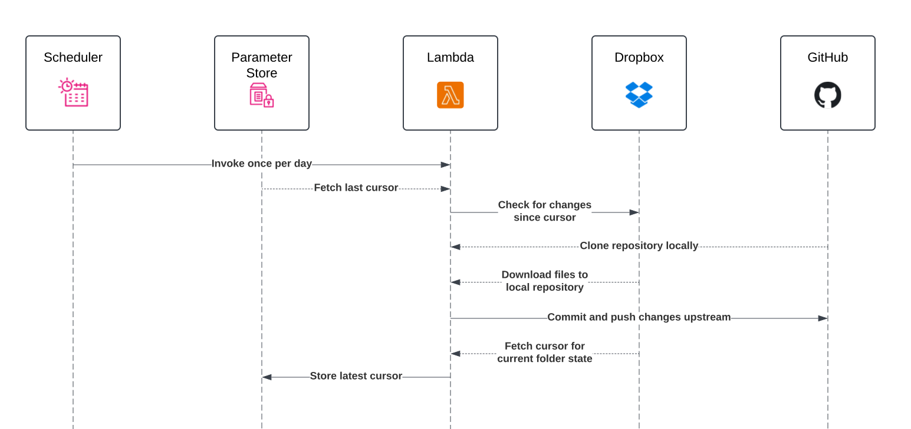

# Dotfiles Sync

Use AWS [EventBridge](https://aws.amazon.com/eventbridge/) and [Lambda](https://aws.amazon.com/lambda/) to automatically back up my personal dotfiles from Dropbox [to GitHub](https://github.com/MatthewWid/dotfiles).

<p align="center"></p>

<p align="center">Scheduled Lambda mirrors changes from Dropbox to GitHub</p>

## Architecture

<p align="center"></p>

### Technologies

|Use-case|Technology used|
|-|-|
|Compute|[Lambda](https://aws.amazon.com/lambda/), [Node.js](https://nodejs.org/en)|
|Job scheduling|[EventBridge Scheduler](https://aws.amazon.com/eventbridge/scheduler/)|
|Persistent storage|[Systems Manager Parameter Store](https://docs.aws.amazon.com/systems-manager/latest/userguide/systems-manager-parameter-store.html)|
|Infrastructure provisioning|[Terraform](https://www.terraform.io)|
|Type-checking|[TypeScript](https://www.typescriptlang.org)|
|Source code bundling|[esbuild](https://esbuild.github.io)|
|Linting and formatting|[Biome](https://biomejs.dev)|

## Local Development

1. Install [Terraform](https://developer.hashicorp.com/terraform/tutorials/aws-get-started/install-cli).

2. Install the [AWS CLI](https://docs.aws.amazon.com/cli/latest/userguide/getting-started-install.html) and set up your [access credentials](https://docs.aws.amazon.com/cli/v1/userguide/cli-chap-authentication.html).

    Set your [profile name](https://docs.aws.amazon.com/cli/latest/userguide/getting-started-quickstart.html#getting-started-quickstart-new-file) to `personal-iamadmin-development` or otherwise set the `aws_profile` [Terraform variable](https://developer.hashicorp.com/terraform/language/values/variables#assigning-values-to-root-module-variables) to your own profile name.

3. Install [Node](https://nodejs.org/en/learn/getting-started/how-to-install-nodejs).

4. Install dependencies with [pnpm](https://pnpm.io/):

    ```bash
    npm i -g pnpm
    pnpm i
    ```

5. Go the [Dropbox App Console](https://www.dropbox.com/developers/apps) and create a new scoped application with the following permissions:

    - `account_info.read`
    - `files.metadata.read`
    - `files.content.read`

6. Go to `https://www.dropbox.com/oauth2/authorize?response_type=code&token_access_type=offline&client_id=<APP_KEY>`, replacing `APP_KEY` with your application key and get an access code.

7. Copy `.env.template` to `.env` and store your application key, secret and access code in the `DROPBOX_APP_KEY`, `DROPBOX_APP_SECRET` and `DROPBOX_ACCESS_CODE` variables, respectively.

8. Run the `get-dropbox-refresh-token` script that exchanges the short-lived access code for a long-lived refresh token:

    ```bash
    pnpm run get-dropbox-refresh-token
    ```

    And then store the returned `refresh_token` value in the `DROPBOX_REFRESH_TOKEN` variable.

9. Go to the [GitHub Developer Settings](https://github.com/settings/personal-access-tokens) and create a new personal access token with access to the target dotfiles repository with the following permissions:

    - Commit statuses: Read-only
    - Contents: Read and write
    - Metadata: Read-only 

    And then add the token as the authentication password in the remote URL and store it in the `GIT_REPO_REMOTE_URL` variable:

    ```
    https://<USERNAME>:<PERSONAL ACCESS TOKEN>@github.com/<REPO URL>
    ```

9. Build the Lambda deployment bundle from source:

    ```bash
    pnpm run build
    ```

10. [Create an S3 bucket](https://docs.aws.amazon.com/AmazonS3/latest/userguide/create-bucket-overview.html) to store the Terraform state file and set the bucket name and region in the `backend` block in `tf/versions.tf`.

11. Copy the following environment variables from `.env` to [`tf/.auto.tfvars`](https://developer.hashicorp.com/terraform/cloud-docs/workspaces/variables#7-local-environment-variables-prefixed-with-tf_var_):

    ```
    DROPBOX_APP_KEY=value         ->    dropbox_app_key = "value"
    DROPBOX_APP_SECRET=value      ->    dropbox_app_secret = "value"
    DROPBOX_REFRESH_TOKEN=value   ->    dropbox_refresh_token = "value"
    GIT_REPO_REMOTE_URL=value     ->    git_repo_remote_url = "value"
    ```

11. Deploy to AWS with Terraform:

    ```bash
    cd tf
    terraform init
    terraform apply
    ```

### npm Scripts

|Command|Description|
|---|---|
|`format`|Format and apply safe lint fixes with [Biome](https://biomejs.dev/).|
|`lint`|Lint code without applying fixes.
|`start`|Run the Lambda function locally.|
|`dev`|Run the Lambda function locally in watch mode.|
|`build`|Bundle the Lambda function source for distribution with [esbuild](https://esbuild.github.io/).|
|`get-dropbox-refresh-token`|Exchange a short-lived Dropbox access code for a long-lived refresh token.|
|`delete-dropbox-cursor-parameter`|Delete the Dropbox folder cursor stored in Parameter Store.|"

### Environment Variables

|Variable|Required (Default)|Description|
|-|-|-|
|`DROPBOX_APP_KEY`|Yes|Dropbox application key.|
|`DROPBOX_APP_SECRET`|Yes|Dropbox application secret.|
|`DROPBOX_REFRESH_TOKEN`|Yes|Long-lived refresh token used to get new access tokens.|
|`DROPBOX_ACCESS_CODE`|No|Interim access code given after Dropbox OAuth2 flow is completed for the first time.<br><br>Used to acquire the initial access and refresh token.|
|`DROPBOX_ACCESS_TOKEN`|No|Short-lived access token used to make requests to Dropbox.<br><br>This should only be used during development, as in production access tokens will be generated at runtime using the refresh token in `DROPBOX_REFRESH_TOKEN`.|
|`DROPBOX_DOTFILES_PATH`|No (`/dotfiles`)|Remote path to the dotfiles folder in your Dropbox account.|
|`GIT_REPO_LOCAL_PATH`|No (`/tmp/dotfiles`)|Local path to clone the Git repository into.|
|`GIT_REPO_REMOTE_URL`|No (`https://github.com/MatthewWid/dotfiles`)|URL of the Git remote to pull and push files from and to.<br><br>Should include authentication details that grant permission to read and write repository contents (Eg, `https://<USERNAME>:<PERSONAL ACCESS TOKEN>@github.com/MatthewWid/dotfiles`).|
|`GIT_REPO_CONFIG_NAME`|No (`Matthew W.`)|Git author name used when creating new commits.|
|`GIT_REPO_CONFIG_EMAIL`|No (`matthew.widdi@gmail.com`)|Git author email used when creating new commits.|
|`PARAMETER_STORE_DROPBOX_CURSOR_NAME`|No (`dotfiles_sync_dropbox_cursor`)|Name of the [AWS Systems Manager Parameter Store](https://docs.aws.amazon.com/systems-manager/latest/userguide/systems-manager-parameter-store.html) parameter that stores the latest [folder cursor](https://www.dropbox.com/developers/documentation/http/documentation#files-list_folder-get_latest_cursor) returned from Dropbox.|
|`PARAMETER_STORE_DROPBOX_CURSOR_DEFAULT_VALUE`|No|Default value for the retrieved Dropbox folder cursor if none is found in Parameter Store.|

## License

This project is licensed under the [MIT license](https://opensource.org/license/mit/).
